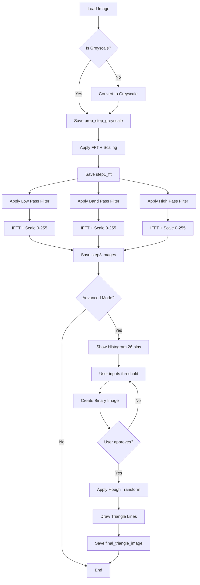

# PRD: FFT Image Processing & Triangle Detection

## Overview

This project implements a Fourier Transform-based image processing pipeline using OpenCV. It demonstrates frequency domain filtering techniques and advanced edge detection for geometric shape recognition.

---

## Project Structure

```
L32_HomeWork/
├── input_image/              # Input images folder
├── output_images/            # All generated output images
├── src/
│   ├── image_utils.py        # Image loading, greyscale conversion, saving (~40 lines)
│   ├── fft_operations.py     # FFT, IFFT, and scaling functions (~50 lines)
│   ├── filters.py            # Low, band, high pass filter masks (~60 lines)
│   ├── histogram_utils.py    # Histogram display and threshold logic (~45 lines)
│   └── triangle_detector.py  # Hough transform and line intersection (~70 lines)
├── main.py                   # Main application entry point (~80 lines)
├── PRD.md                    # This document
├── requirements.txt          # Python dependencies
└── README.md                 # Project documentation
```

> [!TIP]
> All Python files are designed to be **under 150 lines** for maintainability and readability.

---

## Core Workflow

### Step 0: Image Preprocessing

| Aspect | Details |
|--------|---------|
| **Input** | Any image from `input_image/` folder |
| **Process** | Check if image is greyscale; if not, convert to greyscale |
| **Output** | `output_images/prep_step_greyscale.png` |

---

### Step 1: Fast Fourier Transform (FFT)

| Aspect | Details |
|--------|---------|
| **Input** | `prep_step_greyscale.png` |
| **Process** | Apply FFT, shift zero-frequency to center, apply logarithmic scaling for visualization |
| **Scaling** | Use `20 * log(1 + magnitude)` for visible frequency representation |
| **Output** | `output_images/step1_fft.png` |

> [!NOTE]
> The magnitude spectrum should be scaled logarithmically to make low and high frequency components visible simultaneously.

---

### Step 2: Frequency Domain Filtering

Apply **three separate filters** on the FFT result (one at a time):

#### 2.1 Low Pass Filter
| Aspect | Details |
|--------|---------|
| **Input** | `step1_fft.png` (frequency domain data) |
| **Process** | Create circular mask centered at origin, pass low frequencies, block high frequencies |
| **Output** | `output_images/step2_low_pass_filter.png` |

#### 2.2 Band Pass Filter
| Aspect | Details |
|--------|---------|
| **Input** | `step1_fft.png` (frequency domain data) |
| **Process** | Create ring-shaped mask, pass mid-range frequencies, block both low and high frequencies |
| **Output** | `output_images/step2_band_pass_filter.png` |

#### 2.3 High Pass Filter
| Aspect | Details |
|--------|---------|
| **Input** | `step1_fft.png` (frequency domain data) |
| **Process** | Create inverse circular mask, block low frequencies, pass high frequencies |
| **Output** | `output_images/step2_high_pass_filter.png` |

> [!IMPORTANT]
> Each filter is applied independently to the original FFT data, not sequentially.

---

### Step 3: Inverse FFT (IFFT)

Apply IFFT to each filtered image to reconstruct the spatial domain image:

| Filter Type | Input | Output |
|-------------|-------|--------|
| Low Pass | `step2_low_pass_filter` | `output_images/step3_low_pass_filter_after_ifft.png` |
| Band Pass | `step2_band_pass_filter` | `output_images/step3_band_pass_filter_after_ifft.png` |
| High Pass | `step2_high_pass_filter` | `output_images/step3_high_pass_filter_after_ifft.png` |

**Scaling Requirements:**
- Pixel values must be normalized to range `0-255`
- Use `cv2.normalize()` with `NORM_MINMAX`
- Convert to `uint8` for proper image display

---

## Advanced Mode: Triangle Edge Detection

> [!NOTE]
> This workflow applies specifically to images containing triangle figures.

### Advanced Step 1: Pixel Distribution Analysis

| Aspect | Details |
|--------|---------|
| **Input** | `step3_low_pass_filter_after_ifft.png` (low pass IFFT result) |
| **Process** | Calculate and display histogram with **26 bins** |
| **Purpose** | Help user visually determine optimal threshold value |
| **User Action** | Program prompts user to input desired threshold value |

---

### Advanced Step 2: Binary Image Conversion (Interactive)

| Aspect | Details |
|--------|---------|
| **Input** | `step3_low_pass_filter_after_ifft.png` + user threshold |
| **Process** | Convert to binary image based on threshold |
| **Threshold Logic** | Pixels **above** threshold → `255` (black), Pixels **below** threshold → `0` (white) |
| **Output** | `output_images/binary_image.png` |

**Interactive Loop:**
```
1. Apply threshold → Generate binary image
2. Display binary_image to user
3. Ask: "Is the output good? (yes/no)"
4. If YES → Save and proceed
5. If NO → Ask for new threshold → Return to step 1 (overwrite previous)
```

> [!WARNING]
> The binary image will be overwritten on each iteration until the user approves.

---

### Advanced Step 3: Hough Line Transform

| Aspect | Details |
|--------|---------|
| **Input** | `binary_image.png` |
| **Process** | Apply Hough Line Transform to detect triangle edges |
| **Line Drawing** | Draw detected lines **only until intersection** with other lines |
| **Output** | `output_images/final_triangle_image.png` |

**Implementation Notes:**
- Use `cv2.HoughLinesP()` for probabilistic Hough Transform
- Calculate line intersections to determine valid endpoints
- Draw lines connecting only the triangle vertices

---

## Output Images Summary

| Step | Filename | Description |
|------|----------|-------------|
| 0 | `prep_step_greyscale.png` | Greyscale input image |
| 1 | `step1_fft.png` | FFT magnitude spectrum (scaled) |
| 2a | `step2_low_pass_filter.png` | Low pass filtered spectrum |
| 2b | `step2_band_pass_filter.png` | Band pass filtered spectrum |
| 2c | `step2_high_pass_filter.png` | High pass filtered spectrum |
| 3a | `step3_low_pass_filter_after_ifft.png` | IFFT of low pass |
| 3b | `step3_band_pass_filter_after_ifft.png` | IFFT of band pass |
| 3c | `step3_high_pass_filter_after_ifft.png` | IFFT of high pass |
| Adv | `binary_image.png` | Thresholded binary image |
| Adv | `final_triangle_image.png` | Triangle with detected edges |

---

## Module Specifications

> [!IMPORTANT]
> Each module is designed to be **under 150 lines** with single responsibility.

### `src/image_utils.py` (~40 lines)

| Function | Parameters | Returns | Description |
|----------|------------|---------|-------------|
| `load_image(path)` | `str` | `np.ndarray` | Load image from path |
| `ensure_greyscale(img)` | `np.ndarray` | `np.ndarray` | Convert to greyscale if needed |
| `save_image(img, path)` | `np.ndarray`, `str` | `None` | Save image to output folder |
| `create_output_dirs()` | None | `None` | Create output_images folder if not exists |

---

### `src/fft_operations.py` (~50 lines)

| Function | Parameters | Returns | Description |
|----------|------------|---------|-------------|
| `apply_fft(img)` | `np.ndarray` | `np.ndarray` | Apply FFT and shift to center |
| `apply_ifft(fft_data)` | `np.ndarray` | `np.ndarray` | Apply inverse FFT |
| `scale_for_display(magnitude)` | `np.ndarray` | `np.ndarray` | Apply `20 * log(1 + mag)` scaling |
| `normalize_to_255(img)` | `np.ndarray` | `np.ndarray` | Normalize to 0-255 range |

---

### `src/filters.py` (~60 lines)

| Function | Parameters | Returns | Description |
|----------|------------|---------|-------------|
| `create_low_pass_mask(shape, radius)` | `tuple`, `int` | `np.ndarray` | Circular mask for low frequencies |
| `create_high_pass_mask(shape, radius)` | `tuple`, `int` | `np.ndarray` | Inverse circular mask |
| `create_band_pass_mask(shape, r_low, r_high)` | `tuple`, `int`, `int` | `np.ndarray` | Ring-shaped mask |
| `apply_filter(fft_data, mask)` | `np.ndarray`, `np.ndarray` | `np.ndarray` | Apply mask to frequency data |

---

### `src/histogram_utils.py` (~45 lines)

| Function | Parameters | Returns | Description |
|----------|------------|---------|-------------|
| `show_histogram(img, bins=26)` | `np.ndarray`, `int` | `None` | Display histogram with matplotlib |
| `get_threshold_from_user()` | None | `int` | Prompt user for threshold value |
| `apply_binary_threshold(img, thresh)` | `np.ndarray`, `int` | `np.ndarray` | Convert to binary (above=255, below=0) |
| `get_user_approval()` | None | `bool` | Ask user if result is acceptable |

---

### `src/triangle_detector.py` (~70 lines)

| Function | Parameters | Returns | Description |
|----------|------------|---------|-------------|
| `detect_lines(binary_img)` | `np.ndarray` | `list` | Apply HoughLinesP transform |
| `find_line_intersection(line1, line2)` | `tuple`, `tuple` | `tuple` | Calculate intersection point |
| `find_triangle_vertices(lines)` | `list` | `list` | Find 3 intersection points |
| `draw_triangle(img, vertices)` | `np.ndarray`, `list` | `np.ndarray` | Draw lines between vertices |

---

### `main.py` (~80 lines)

| Function | Description |
|----------|-------------|
| `run_basic_pipeline(input_path)` | Execute Steps 0-3 (greyscale, FFT, filters, IFFT) |
| `run_advanced_pipeline()` | Execute Advanced Steps 1-3 (histogram, threshold, Hough) |
| `main()` | Entry point with argument parsing |

**Main Function Flow:**
```python
def main():
    # Parse args for input image and mode (basic/advanced)
    # Run basic pipeline
    # If advanced mode: run advanced pipeline
```

---

## Technical Requirements

### Dependencies
```
opencv-python (cv2)
numpy
matplotlib (for histogram display)
```

### OpenCV Functions Used

| Function | Purpose |
|----------|---------|
| `cv2.imread()` | Load input image |
| `cv2.cvtColor()` | Convert to greyscale |
| `cv2.dft()` | Discrete Fourier Transform |
| `cv2.idft()` | Inverse DFT |
| `np.fft.fftshift()` | Shift zero-frequency to center |
| `cv2.normalize()` | Normalize pixel values to 0-255 |
| `cv2.threshold()` | Binary thresholding |
| `cv2.HoughLinesP()` | Probabilistic Hough Transform |
| `cv2.line()` | Draw detected lines |

---

## User Interaction Flow



---

## Acceptance Criteria

### Basic Mode
- [ ] Greyscale conversion works correctly
- [ ] FFT output shows visible frequency spectrum
- [ ] All three filters produce distinct outputs
- [ ] IFFT images are properly scaled (0-255 range)
- [ ] All images saved to `output_images/` folder

### Advanced Mode
- [ ] Histogram displays 26 bins correctly
- [ ] Threshold input loop works interactively
- [ ] Binary image uses correct threshold logic (above=255, below=0)
- [ ] User can retry with different thresholds
- [ ] Hough Transform detects triangle lines
- [ ] Lines drawn only to intersection points
- [ ] Final triangle image clearly shows detected edges
